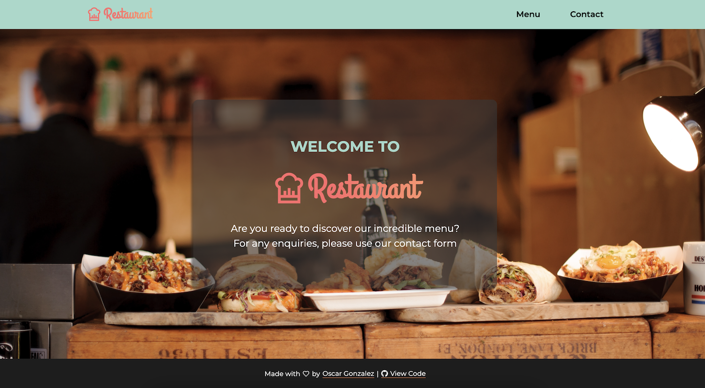

<a name="readme-top"></a>
<!-- HEADER -->
<div align="center">

[![Contributors][contributors-shield]][contributors-url]
[![Forks][forks-shield]][forks-url]
[![Stargazers][stars-shield]][stars-url]
[![Issues][issues-shield]][issues-url]
<br />
<br />
<div align="center">

  # Responsive Layout
  <a href="https://trison.oscarweb.dev">View Demo</a> ·
  <a href="https://github.com/oscargonzalezdev/trison-task/issues/new">Report Bug</a>·
  <a href="https://www.buymeacoffee.com/oscardev">Support</a>
  </div>
</div>
<br/>

<!-- TABLE OF CONTENTS -->
<details>
  <summary>Table of Contents</summary>
  <ol>
    <li><a href="#about-the-project">About The Project</a></li>
    <li><a href="#getting-started">Getting Started</a></li>
    <li><a href="#roadmap">Roadmap</a></li>
    <li><a href="#author">Author</a></li>
    <li><a href="#links">Links</a></li>
  </ol>
</details>
<br/>

<!-- ABOUT THE PROJECT -->
## About The Project

[](https://trison.oscarweb.dev/)

This repository contains my solution for a technical test.
The task is to create a responsive menu layout populated with elements obtained from an API.
It should also have a contact form with corresponding validations.

### Built With

- [Next.js](https://nextjs.org/)

<!-- GETTING STARTED -->
## Getting Started

To get and run a local copy of this project follow the instructions below.

### Installation

1. Clone the repo
   ```sh
   git clone https://github.com/oscargonzalezdev/trison-task.git
   ```
2. Install NPM packages
   ```sh
   npm install
   ```
3. Run the project locally
   ```sh
    npm run dev
   ```
4. Open [http://localhost:3000](http://localhost:3000) with your browser to see the result.

<!-- ROADMAP -->
## Roadmap

- [x] Layout component.
- [x] MenuDetails component.
- [x] Form Component
- [x] Home Page

<!-- CONTACT -->
## Author

Oscar González <br/>
Frontend Web Developer

[www.oscarweb.dev](https://oscarweb.dev) |
[LinkedIn](https://linkedin.com/in/oscargonzalezdev) |
[Twitter](https://twitter.com/oscardev_)

<!-- RESOURCES -->
## Links

- GitHub repository: [https://github.com/oscargonzalezdev/trison-task](https://github.com/oscargonzalezdev/trison-task)
- Demo: [https://trison.oscarweb.dev](https://trison.oscarweb.dev)

## Note

To learn more about Next.js, please visit the [official documentation](https://nextjs.org/docs)

<div align="right">(<a href="#readme-top">back to top</a>)</div>

<!-- MARKDOWN LINKS & IMAGES -->
<!-- https://www.markdownguide.org/basic-syntax/#reference-style-links -->

[contributors-shield]: https://img.shields.io/github/contributors/oscargonzalezdev/trison-task.svg?style=for-the-badge
[contributors-url]: https://github.com/oscargonzalezdev/trison-task/graphs/contributors
[forks-shield]: https://img.shields.io/github/forks/oscargonzalezdev/trison-task.svg?style=for-the-badge
[forks-url]: https://github.com/oscargonzalezdev/trison-task/network/members
[stars-shield]: https://img.shields.io/github/stars/oscargonzalezdev/trison-task.svg?style=for-the-badge
[stars-url]: https://github.com/oscargonzalezdev/trison-task/stargazers
[issues-shield]: https://img.shields.io/github/issues/oscargonzalezdev/trison-task.svg?style=for-the-badge
[issues-url]: https://github.com/oscargonzalezdev/trison-task/issues
[linkedin-shield]: https://img.shields.io/badge/-LinkedIn-black.svg?style=for-the-badge&logo=linkedin&colorB=555
[linkedin-url]: https://linkedin.com/in/oscargonzalezdev